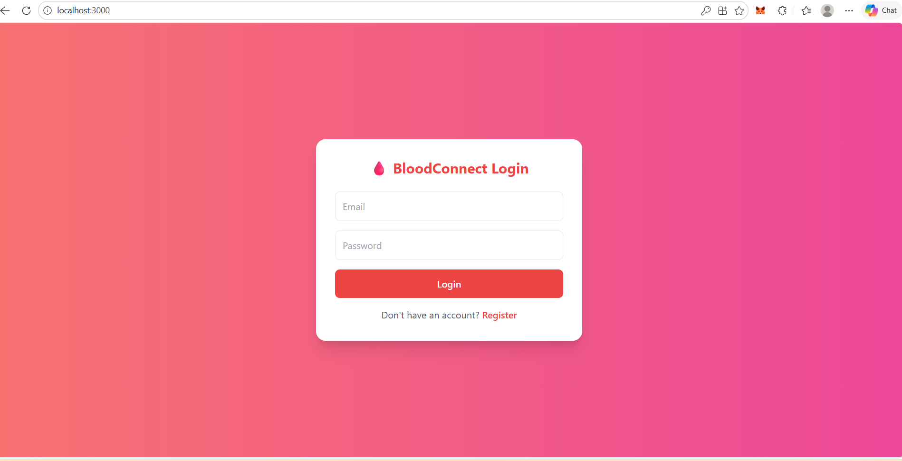
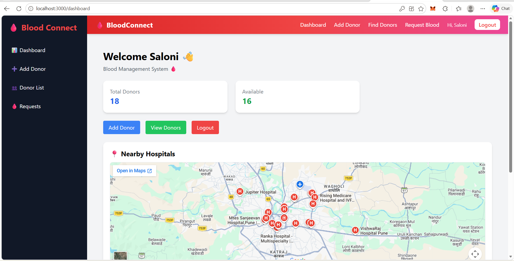
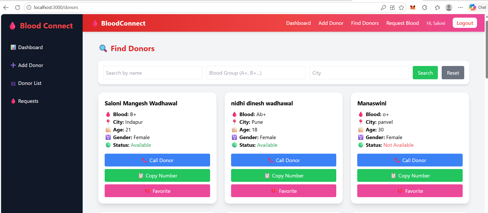
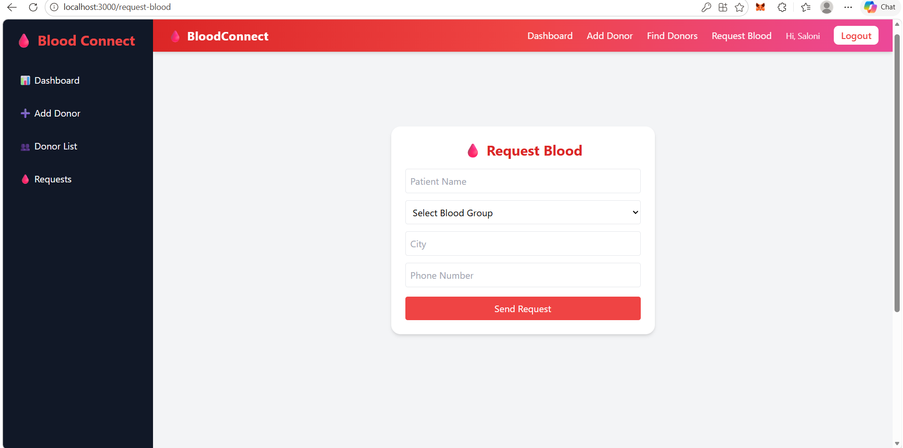

# 🩸 Blood Management System

---

## 🌐 Overview

A **Full Stack Web Application** that helps manage blood donation and request processes efficiently.  
It connects **donors, recipients, and admins** to ensure quick response in emergency situations.

---

## 🚨 Problem Statement

Many patients face difficulty finding blood donors due to:

- ❌ Poor coordination  
- ❌ Delayed communication  
- ❌ Lack of centralized system  

---

## 💡 Solution

This platform provides a **smart and centralized system** to:

- ✅ Request blood easily  
- ✅ Manage requests via admin dashboard  
- ✅ Improve real-time communication  

---

## ✨ Features

- 📝 Blood Request System  
- 📊 Admin Dashboard  
- 🔄 Accept / Reject Requests  
- ⚡ Real-time Updates  
- 🎯 Clean & Responsive UI  

---

## 🖼️ Screenshots

### 🏠 Login Page


### 🔐 Dashboard


### 📝 Add New Donor


### 📊 Find Donor


### 📊 Request Donor


---

## 🛠️ Tech Stack  

| 💻 Technology | 🚀 Usage |
|--------------|--------|
| React.js | Frontend UI |
| Node.js | Backend Runtime |
| Express.js | API Handling |
| MongoDB | Database |

---

## ⚙️ How It Works  

1.Users register/login into the system.
2.Donors can add their details and availability.
3.Patients or hospitals can submit blood requests.
4.The system processes and stores requests in the database.
5.Matching donors can be identified based on requirements.

---

## 📂 Project Structure

blood-management-system/
│── client/        # Frontend (React)
│── server/        # Backend (Node + Express)
│── database/      # MongoDB connection & models
│── README.md


---

🚀 Installation & Setup


### ▶️ Clone the repository

git clone https://github.com/your-username/blood-management-system.git

cd blood-management-system

## ▶️ Run Backend

```bash
cd server
npm install
npm start
```

## ▶️ Run Frontend

```bash
cd client
npm install
npm start
```
---


### 🔑 Environment Variables

Create a .env file inside the server folder:

MONGO_URI=your_mongodb_connection_string
PORT=5000

---

## 👩‍💻 Author

**Saloni Mangesh Wadhawal**
🎓 Computer Engineering Student

---

